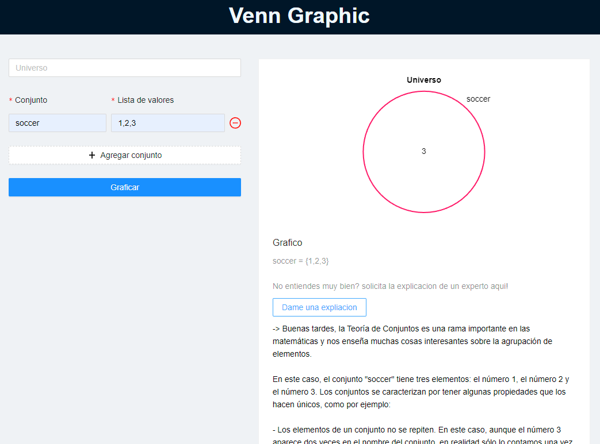

<h1 align="center"><b>VENN GRAPHIC</b></h1>
<h6 align="center">web to interact and learn sets</h6>

<!-- 
Live Site <a href="https://newtpomofocus.netlify.app">Here</a>.
 -->

1. Bootstrapped with [Vite](https://vitejs.dev/).

### 🛠 Built with

- VueJs
- Ant Design Vue
- ChartJS
- OpenAI API

### 💻 Author

- Portfolio - [@newtyf](https://newtyf.com/)
- Instagram - [@newtyf](https://www.instagram.com/newt_yf/)
- LinkedIn - [@newtyf](https://www.linkedin.com/in/axel-mu%C3%B1oz/)
- Frontend Mentor - [@newtyf](https://www.frontendmentor.io/profile/TREz-bits)
